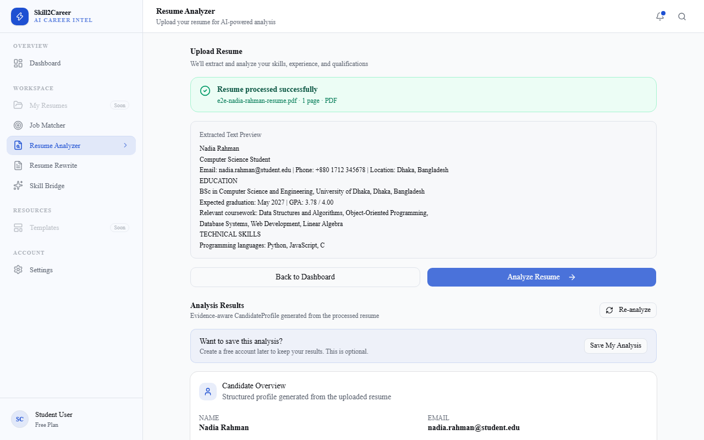
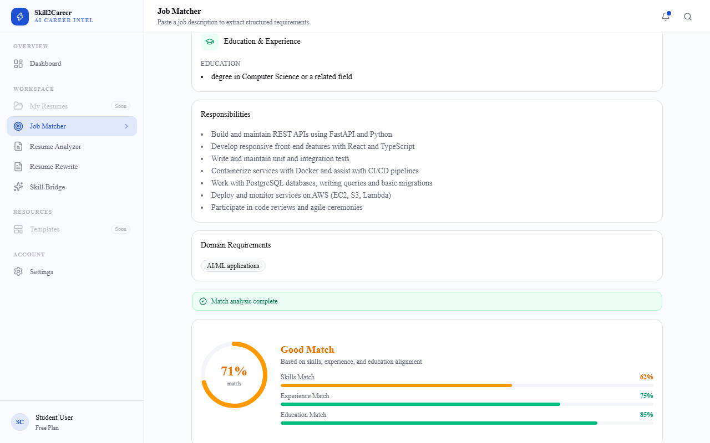
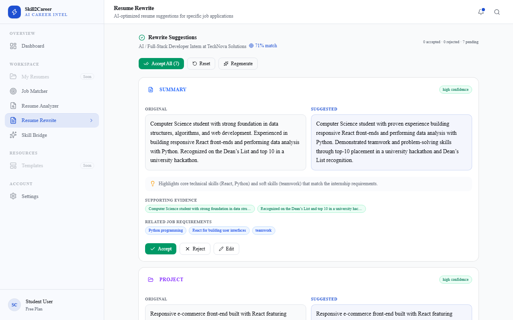
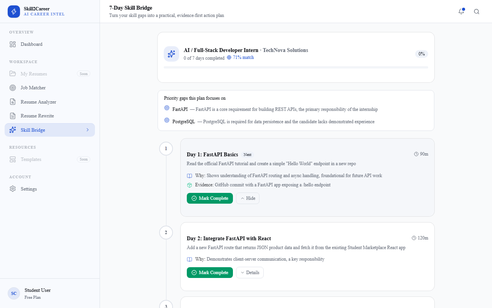
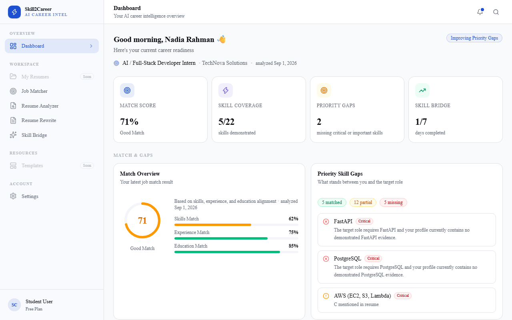

# Skill2Career AI

**AI-powered career intelligence for students, internship seekers, fresh graduates, and early-career professionals.**

> Understand your gap. Fix your application. Become more job-ready.

Upload a resume, paste a target job or internship description, and receive AI-driven profile analysis, deterministic job matching, evidence-aware resume rewrite suggestions, and a personalized 7-day skill-building plan — all in one place.

---

## Core Features

### Resume / Portfolio Analyzer

- PDF and DOCX upload with server-side text extraction and cleaning
- Structured candidate profile: skills, experience, education, projects, certifications, and other evidence
- Evidence-linked skills with confidence scoring
- Zod runtime validation on every extracted field
- Profile reuse across workflows for efficiency

### Job Match + Skill Gap

- Paste any target job or internship description
- Extract structured job requirements (title, company, location, requirements, opportunity type)
- Deterministic candidate-to-job comparison — the final match score does **not** use AI
- Explainable match score with skills, experience, and education evaluation
- Strengths, weaknesses, prioritized gaps, and actionable recommendations

### Job-Specific Resume Rewrite

- AI-generated, job-specific tailoring suggestions
- Evidence-aware rewriting — every suggestion is grounded in your existing profile
- Hallucination / unsupported-claim protection
- Accept, Reject, Edit, and Accept All controls
- Original candidate data is always preserved

### 7-Day Skill Bridge

- Personalized 7-day improvement plan focused on highest-priority gaps
- Practical daily actions with project and evidence-building activities
- Daily progress tracking
- Readiness-to-apply indicator

### Explainable Dashboard

- **Where am I?** — current profile strength and latest match score
- **What is missing?** — prioritized skill gaps and weaknesses
- **What should I do next?** — recommended actions across rewrite, skill bridge, and profile

The dashboard uses stored data and deterministic calculations — no additional AI calls required.

---

## Product Flow

```text
Analyze → Compare → Improve → Build → Apply
```

1. Upload your resume
2. Build a structured candidate profile
3. Add a target opportunity (job or internship description)
4. Analyze the match
5. Identify gaps
6. Improve your resume with evidence-aware rewrite suggestions
7. Follow your personalized 7-day Skill Bridge
8. Track progress and apply

---

## Architecture

```text
Next.js 16 + React 19 + TypeScript
        ↓
Tailwind CSS + shadcn/ui + Lucide
        ↓
Next.js Server Actions / Modular Monolith
        ├── AI Provider Layer
        │   ├── Groq (Primary): openai/gpt-oss-20b
        │   └── OpenAI (Fallback): gpt-4o-mini
        ├── Document Layer
        │   ├── pdf-parse (PDF)
        │   └── Mammoth (DOCX)
        ├── Zod Validation
        └── Supabase
            ├── PostgreSQL + JSONB
            ├── Storage
            └── RLS + ownership
                    ↓
             Deterministic Match Engine
                    +
              7-Day Skill Bridge
                    ↓
                Dashboard
                    ↓
                 Vercel
```

---

## Technology Stack

### Frontend

| Technology | Role |
| --- | --- |
| Next.js 16 | App Router, Server Actions, SSR |
| React 19 | UI framework |
| TypeScript | Type safety |
| Tailwind CSS v4 | Utility-first styling |
| shadcn/ui + Base UI | Component library |
| Lucide React | Icons |

### Backend

| Technology | Role |
| --- | --- |
| Next.js Server Actions | Server-side application logic |
| Modular monolith | Organized feature modules |

### Database & Storage

| Technology | Role |
| --- | --- |
| Supabase | Managed PostgreSQL + Auth + Storage |
| PostgreSQL + JSONB | Relational data + flexible JSON columns |
| Row Level Security | Ownership-aware access control |
| Indexes and triggers | Query performance and data integrity |

### AI

| Technology | Role |
| --- | --- |
| Groq | Primary AI provider (`openai/gpt-oss-20b`) |
| OpenAI | Fallback provider (`gpt-4o-mini`) |
| OpenAI-compatible SDK | Unified API across providers |
| JSON object response mode | Structured AI output + parsing |
| Zod runtime validation | Schema enforcement on AI responses |
| Low reasoning effort | Optimized for structured extraction |

### Documents

| Technology | Role |
| --- | --- |
| `pdf-parse` | PDF text extraction |
| Mammoth | DOCX text extraction |
| Custom cleaning pipeline | Normalization and deduplication |

### Matching & Intelligence

| Component | Description |
| --- | --- |
| Deterministic Match Engine | Custom TypeScript engine — no AI in final scoring |
| Skills matching | Normalized comparison with substring fallback |
| Experience matching | Year-range and keyword evaluation |
| Education matching | Degree-level and field-of-study comparison |
| Evidence-aware rewrite validation | Suggestions grounded in candidate data |

### Testing

| Tool | Coverage |
| --- | --- |
| Vitest | Unit and integration tests |
| Playwright | End-to-end browser tests |
| Custom test suites | Isolation, concurrency, and hallucination validation |

### Deployment

| Platform | Role |
| --- | --- |
| Vercel | Frontend hosting and serverless functions |
| Supabase | Database and storage |

---

## Matching Engine

The final match score is **deterministic** — it does not use AI. This ensures consistency and explainability across every analysis.

### Score Weighting

```text
Skills       → 50%
Experience   → 30%
Education    → 20%
```

### Skill Importance

```text
Critical      → 60%
Important     → 25%
Nice-to-have  → 15%
```

### Requirement States

Each job requirement is classified as one of:

- **Demonstrated** — candidate has evidence of this skill
- **Mentioned** — skill appears in profile but lacks supporting evidence
- **Missing** — not found in the candidate profile

---

## AI Workflows

### Resume Analyzer

```text
Resume → Text Extraction → Cleaning → Groq → JSON → Zod → Candidate Profile → Supabase
```

### Job Analyzer

```text
Job Description → Groq → Structured Job Target → Zod → Supabase
```

### Resume Rewriter

```text
Candidate Profile + Job Target + Match Analysis + Evidence
→ Groq
→ Rewrite Suggestions
→ Evidence Validation
→ Review / Accept / Reject / Edit
```

### Skill Bridge

```text
Candidate Profile + Job Target + Priority Gaps
→ Groq
→ 7-Day Skill Bridge
→ Supabase
→ Daily Progress Tracking
```

---

## Security & Reliability

- Anonymous-first MVP — no sign-up required to start
- Server-side database writes only
- Ownership-aware access control
- Supabase Row Level Security (RLS)
- Private resume storage in Supabase Storage
- MIME type + magic-byte file validation
- File size limits and zero-byte checks
- Rate limiting
- Zod runtime validation on all inputs and AI outputs
- Evidence-aware anti-hallucination validation
- Original resume data is always preserved
- AI provider fallback (Groq → OpenAI on transient failure)

---

## Screenshots

```text
screenshots/
├── resume-analyzer.png
├── job-matcher.png
├── resume-rewrite.png
├── skill-bridge.png
└── dashboard.png
```

### Resume Analyzer



### Job Matcher



### Resume Rewrite



### Skill Bridge



### Dashboard



---

## Getting Started

### 1. Clone and install

```bash
git clone https://github.com/YOUR_USERNAME/YOUR_REPOSITORY.git
cd YOUR_REPOSITORY
npm install
```

### 2. Configure environment variables

```bash
cp .env.example .env.local
```

Edit `.env.local` and fill in your real credentials:

```env
NEXT_PUBLIC_SUPABASE_URL=
NEXT_PUBLIC_SUPABASE_ANON_KEY=
SUPABASE_SERVICE_ROLE_KEY=

GROQ_API_KEY=

AI_PROVIDER=groq
AI_FALLBACK_PROVIDER=openai
AI_MODEL=openai/gpt-oss-20b

OPENAI_API_KEY=
```

> **Never commit `.env.local` or any file containing real credentials.**

### 3. Apply Supabase migrations

Run the SQL files in `supabase/migrations/` in order (`001` → `007`) in your Supabase SQL editor.

### 4. Run the dev server

```bash
npm run dev
```

Open [http://localhost:3000](http://localhost:3000).

---

## Available Scripts

| Command | Description |
| --- | --- |
| `npm run dev` | Start the Next.js dev server with Turbopack |
| `npm run build` | Build for production |
| `npm start` | Start the production server |
| `npm run lint` | Run ESLint |
| `npm test` | Run Vitest unit tests |

---

## Project Structure

```text
app/
├── actions/
│   ├── upload-resume.ts
│   ├── analyze-resume.ts
│   ├── analyze-job.ts
│   ├── compute-match.ts
│   ├── generate-rewrite.ts
│   ├── skill-bridge.ts
│   └── dashboard.ts
├── (auth)/
│   ├── login/
│   └── register/
├── (dashboard)/
│   ├── analysis/
│   ├── dashboard/
│   ├── job-matcher/
│   ├── resume/
│   ├── resumes/
│   ├── settings/
│   ├── skill-bridge/
│   └── templates/
├── layout.tsx
└── page.tsx

components/
├── dashboard/        # Dashboard feature panels
├── layout/           # Header, sidebar
├── shared/           # Reusable shared components
├── ui/               # Base UI primitives (shadcn)
└── *.tsx             # Feature panels (analysis, match, rewrite, skill bridge)

lib/
├── ai/               # AI provider layer, prompts, workflow services
├── dashboard/        # Dashboard aggregation logic
├── document-processing/ # PDF and DOCX text extraction
├── rewrite/          # Resume rewrite engine
├── scoring/          # Deterministic job-match engine
├── security/         # Validation and protection utilities
├── skill-bridge/     # Skill Bridge planning logic
└── supabase/         # Browser, SSR, and service-role clients

schemas/              # Zod runtime contracts
types/                # Shared TypeScript domain types
supabase/migrations/  # Numbered SQL migrations (001–007)
```

---

## Testing

The test suite covers:

- Resume analysis (extraction, cleaning, Zod validation)
- Job analysis (structured requirement extraction)
- Deterministic matching (skills, experience, education scoring)
- Rewrite validation (evidence-aware suggestions)
- Hallucination prevention (unsupported-claim detection)
- Skill Bridge (7-day plan generation)
- Dashboard aggregation
- Anonymous-user isolation
- Concurrency (multi-user simultaneous access)
- End-to-end golden journey flows

Run tests:

```bash
npm test
```

---

## Current MVP Scope

### Included

- Resume / portfolio analysis
- Job description analysis
- Deterministic match scoring
- Skill gap analysis
- Job-specific resume rewriting
- 7-day Skill Bridge
- Explainable dashboard
- Anonymous-first usage

### Outside Current MVP

- Full account-management UX
- Advanced resume-template marketplace
- Recruiter marketplace
- Job scraping / job-board crawler
- Hiring / interview prediction guarantees
- Production distributed rate limiting
- pgvector semantic retrieval

---

## Future Roadmap

- Complete authentication UX
- Resume version management
- Advanced resume templates
- Deterministic resume PDF rendering
- Job discovery integrations
- Persistent career history
- pgvector / semantic retrieval
- Personalized learning recommendations
- Advanced analytics
- University / team deployments
- Distributed production rate limiting

---

## Product Philosophy

| Principle | Meaning |
| --- | --- |
| **Evidence over hype** | Every claim is supported by candidate evidence |
| **Action over information** | Every analysis leads to a useful next step |
| **Specific over generic** | Recommendations are tied to the target opportunity |
| **Explainable by default** | Users understand why a result was produced |
| **Simple surface, strong engine** | Clean interface backed by powerful analysis |

---

## License

> This project is currently an MVP / hackathon project. Add the final project license here before broader open-source distribution.
